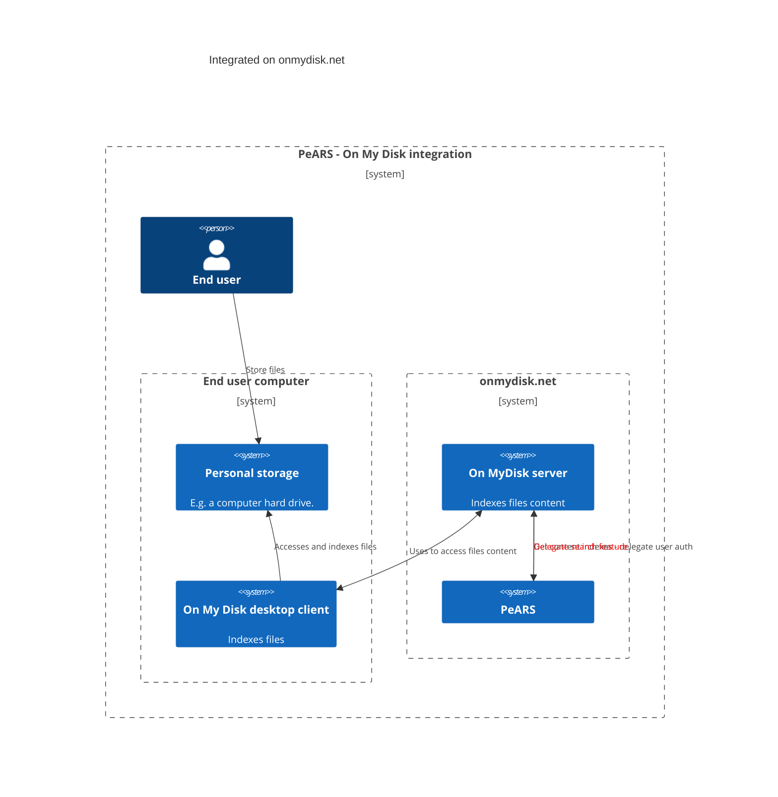

## Deployment description

Various possible deployments configurations of PeARS combined with On My Disk are described below.

### Integrated on onmydisk.net

In this deployment PeARS is hosted along the server side component of On My Disk.

